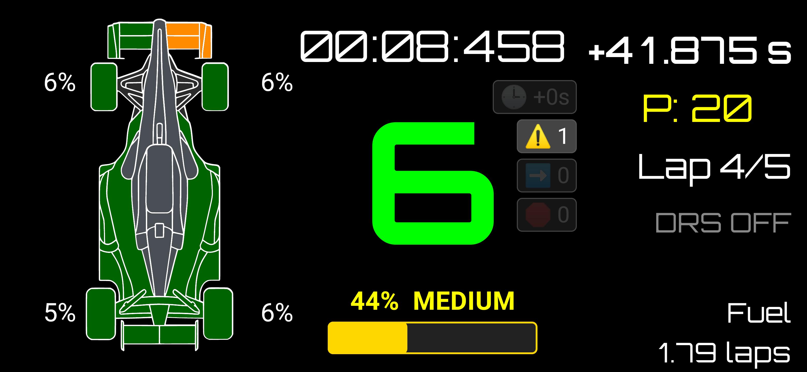
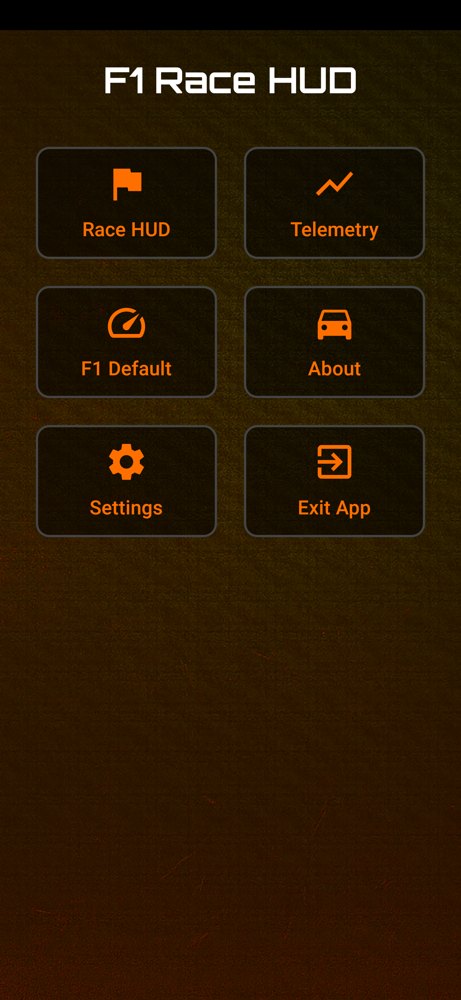
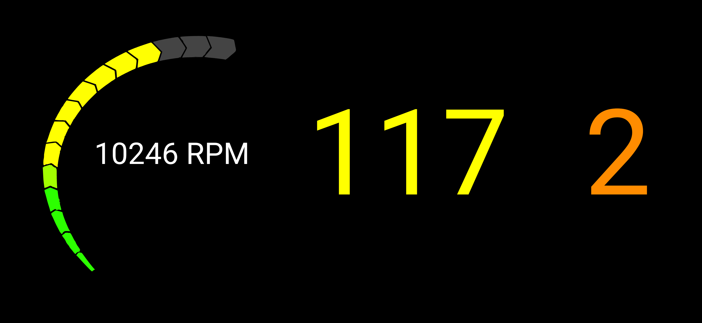
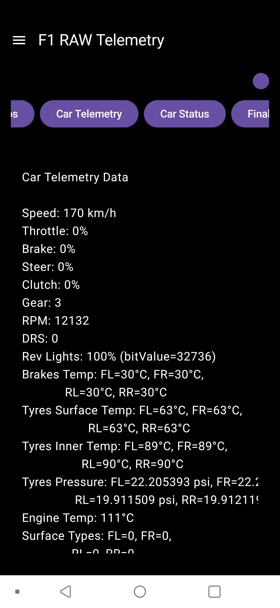

# Screenshots

Below are the app screenshots, arranged so that:
- Landscape images appear one per row
- Portrait images appear two per row
- Each screenshot includes a short title and description

## Landscape

### Dashboard Overview

  

A wide view of the main dashboard showing the core UI layout.

### Settings Panel

  

Full-width screenshot of the settings interface.

## Portrait

### Login & Authentication

  
  

Two portrait screens showing the login and authentication flow.
